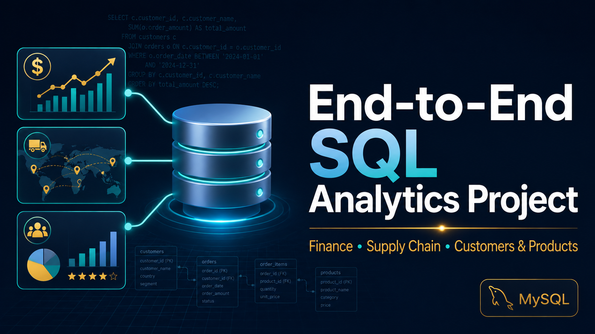

## Project Overview

This project demonstrates real-world SQL analytics solutions using the AtliQ Hardware business dataset. The project focuses on solving business problems related to:

- Finance Analytics
- Customer Analytics
- Product Analytics
- Market Analytics
- Supply Chain Analytics

The goal of this project is to simulate how SQL is used in real business environments for reporting, KPI tracking, forecasting analysis, and operational decision-making.

---

# Project Acknowledgement

This project was developed using the AtliQ Hardware dataset as part of the Codebasics SQL Bootcamp and further enhanced with additional analytics reporting, KPI engineering, business-focused SQL reporting, and professional GitHub project structuring.

---

# Tools & Technologies Used

- MySQL
- MySQL Workbench
- SQL
- GitHub

---

# Database Used

AtliQ Hardware Business Dataset

Main tables used:

- fact_sales_monthly
- fact_forecast_monthly
- fact_gross_price
- fact_pre_invoice_deductions
- fact_post_invoice_deductions
- dim_customer
- dim_product
- dim_date

---

# Project Modules

## 1. Finance Analytics

Finance analytics reports focused on:

- Customer Sales Analysis
- Monthly Gross Sales
- Yearly Gross Sales
- Market Badge Analysis
- Net Sales Analysis

### SQL Concepts Used

- JOINs
- Aggregations
- GROUP BY
- ORDER BY
- Financial KPI Calculations

---

## 2. Top Customers, Products & Markets Analytics

Business analytics reports focused on:

- Pre-Invoice Discount Analysis
- SQL Query Optimization
- Net Invoice Sales Analysis
- Reusable SQL Views
- Final Net Sales Reporting

### SQL Concepts Used

- CTEs
- SQL Views
- Query Optimization
- Complex Joins
- Reusable Business Logic

---

## 3. Supply Chain Analytics

Supply chain reports focused on:

- Forecast Accuracy Analysis
- Net Error Analysis
- Forecast vs Actual Sales
- Customer Forecast Accuracy Ranking
- Supply Chain KPI Dashboard Queries

### SQL Concepts Used

- KPI Engineering
- Variance Analysis
- CASE Statements
- Forecast Analytics
- Operational Reporting

---

# Key SQL Skills Demonstrated

- Advanced SQL Queries
- Common Table Expressions (CTEs)
- SQL Views
- Aggregations
- KPI Calculations
- Business Reporting
- Financial Analytics
- Supply Chain Analytics
- Query Optimization
- Forecast Accuracy Analysis
- Variance Analysis

---

# Business Problems Solved

- Sales performance tracking
- Forecast accuracy monitoring
- Customer sales analysis
- Net sales calculations
- Supply chain KPI reporting
- Market performance evaluation
- Operational variance analysis

---

# Repository Structure

```text
Finance_Analytics/
Top_Customers_Products_Markets/
Supply_Chain_Analytics/
